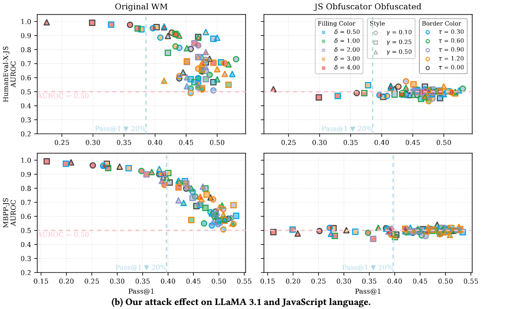

# Disappearing Ink

This is the repository of the paper *Disappearing Ink: Obfuscation Breaks N-gram Code Watermarks in Theory and Practice.*

<div style="display: flex; justify-content: center;">
  <div style="display: flex; max-width:90%; height: auto;">
    
  </div>
</div>


## How to Run

### 1. Environment Preparing

- **Obfuscators**: Install 
[UglifyJS](https://github.com/mishoo/UglifyJS),
[JS Obfuscator](https://github.com/javascript-obfuscator/javascript-obfuscator),
[Python-Minifier](https://github.com/dflook/python-minifier),
and [PyMinifier](https://github.com/liftoff/pyminifier)
in your environment, make sure they can be called by command line.
- **LLMs**: `torch==2.5.0` and `transformers==4.47.0`.

### 2. Task Initialization

First, the tasks can be initialized by running `python src/manage/task_init.py`.
It will initialize task files in `data/task`.
The directory structure will be:
```
data/task/
├── Llama31Instruct8B--sweet--humaneval_js
│   ├── 001
│   │   ├── generate.jsonl
│   │   └── obfuscate.jsonl
│   ├── 002
│   │   ├── generate.jsonl
│   │   └── obfuscate.jsonl
│   ├── 003
│   │   ├── generate.jsonl
...
```
The direct subdirectory of `data/task` is named in form of `{model_short_name}--{watermarking_name}--{dataset_name}`, and each secondary subdirectory corresponds with one parameter combination under this setting.

The `generate.jsonl` files and `obfuscate.jsonl` files include configurations for watermarked code generation and obfuscation, respectfully.

### 3. Task Running

The tasks can be run with command line like:
```
python main.py -t Llama31Instruct8B--sweet--humaneval_js -d 001
```

After that, the results can be found at `data/result`.
The `data/result` directory structure will be:
```
data/result
├── DSCoderBase33B--no_wm--humaneval_js
│   ├── 001
│   │   ├── generate.jsonl
│   │   ├── metrics.jsonl
│   │   └── obfuscate.jsonl
│   ├── 002
│   │   ├── generate.jsonl
│   │   ├── metrics.jsonl
│   │   └── obfuscate.jsonl
│   ├── 003
│   │   ├── generate.jsonl
```
The results of watermarked code generated code, obfuscated code, and calculated metrics can be found at `generate.jsonl`, `obfuscate.jsonl`, `metrics.jsonl`, respectfully.

### 4. Slurm

The Slurm users can run `python src/manage/task_init.py --slurm --log_dir [YOUR_LOG_DIR]` to initialize Slurm scripts in `data/slurm/task`. 
It will also output a `data/slurm/sbatch.sh`. Run `sh data/slurm/sbatch.sh` to start all Slurm jobs.

